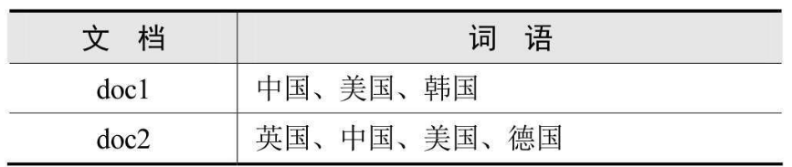
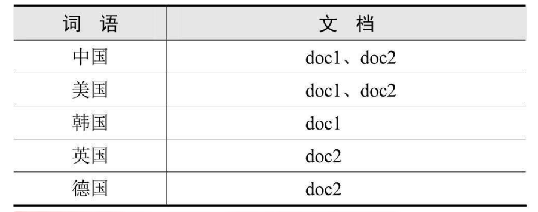
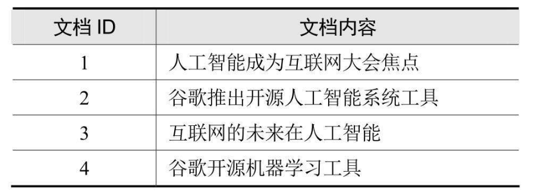
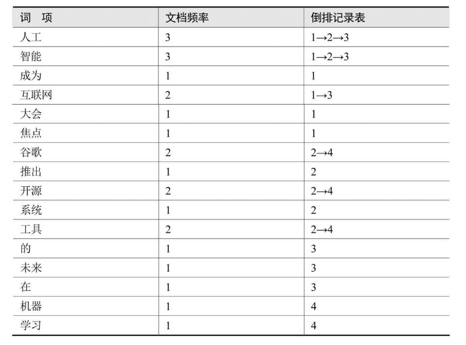
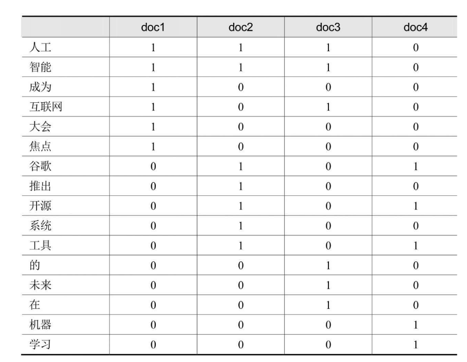

## 分词算法

### 分词算法概述

1. 英文分词的原理
   基本的处理流程是：输入文本、词汇分割、词汇过滤（去除停留词）、词干提取（形态还原）、大写转为小写、结果输出。
2. 中文分词的原理。
   中文分词主要有3种方法：基于词典匹配的分词方法、基于语义理解的分词、基于词频统计的分词。

### 词典匹配分词法

查字典分词实际上就是把一个句子从左向右扫描一遍，遇到字典中有的词就标识出来，遇到复合词就找到最长的词匹配，
遇到不认识的字串则切分成单个词。按照匹配操作的扫描方向不同，字典匹配分词方法可以分为正向匹配、逆向匹配以及
结合了两者的双向匹配算法；按照不同长度优先匹配的情况，可以分为最大（最长）匹配和最小（最短）匹配；按照是否与
词性标注过程相结合，又可以分为单纯分词方法和分词与词性标注相结合的方法。几种常用的词典分词方法如下：

* 正向最大匹配（由左到右的方向）
* 逆向最大匹配（由右到左的方向）
* 最少切分（是每一句中切除的词数最小）

由于中文分词最大的问题是歧义处理，结合中文语言自身的特点，经常采用逆向匹配的切分算法，处理的精度高于正向匹配，产生的切分
歧义现象也较少

### 语义理解分词法

基于语义理解的分词方法是模拟人脑对语言和句子的理解，达到识别词汇单元的效果。基本模式是把分词、句法、语义分析并行进行，
利用句法和语义信息来处理分词的歧义。
一般结构中通常包括分词子系统、句法语义子系统、调度系统。
目前国内外对汉语语言知识的理解和处理能力还没有达到语义层面，具体到语言信息很难组织成机器可直接读取、计算的形式，因此目前
基于语义理解 的分词系统还处在试验阶段。

### 词频统计分词法

这种做法基于人们对中文词语的直接感觉。通常词是稳定的字的组合，因此在中文文章的上下文中，相邻的字搭配出现的频率越多，就越
有可 能形成一个固定的词。 根据n元语法知识可以知道，字与字相邻同时出现的频率或概率能够较好地反映成词的可信度。
基于词频统计的分词方法只需要对语料中的字组频度进行统计，不需要切分词典，因而又叫作无词典分词法或统计分词方法。

这种方法经常抽出一些共现频度高但并不是词的常用字组，需要专门处理，提高精确度。
实际应用的统计分词系统都使用一个基本的常用词词典，把字典分词和统计分词结合使用。基于统计的方法能很好地解决词典未
收录新词的处理问题，即将中文分词中的串频统计和串匹配结合起来， 既发挥匹配分词切分速度快、效率高的特点，又利用了无词典
分词结合上下文识别生词、自动消除歧义的优点。

## 倒排索引

倒排索引（Inverted index），也常被称为反向索引，是一种索引方法，被用来存储在全文搜索下某个单词在一个文档或者一组文档
中的存储位置的映射，它是文档检索系统中最常用的数据结构。
下面以简单通俗的例子来理解倒排索引，假设现在有两个文档doc1和doc2, doc1包含3个关键词：中国、美国、韩国，doc2中包含4个
关键词： 中国、美国、德国、英国，文档和词语的包含关系（也就是正排索引）

文档-单词对照表那么词语 所属的文档关系，也就是倒排索引

另一个例子

构建后的内容

## 布尔检索模型

布尔检索法是指利用布尔运算符连接各个检索词，然后由计算机进行逻辑运算，找出所需信息的一种检索方法。

布尔检索模型中主要有AND、OR、NOT三种逻辑运算，布尔逻辑运算符的作用是把检索词连接起来，构成一个逻辑检索式。

运算符之间的优先级：NOT > AND > OR

小括号可以设置范围，与数学中的加减乘除括号运算规则相似

对于下面的图，在文档中出现为1，没有为0

对下面的语句进行查询

谷歌AND开源NOT大会

分别取出“谷歌”，“开源”，“大会”对应的行向量，对大会对应的行向量取反

谷歌： 0 1 0 1

开源： 0 1 0 1

大会： 1 0 0 0 （取反： 0 1 1 1）

0101 AND 0101 = 0101

0101 AND 0111 = 0101

所以文档2和文档4符合查询条件

布尔检索模型简单直观，有以下优点：
第一，与人们的思维习惯一致：用户可以通过布尔逻辑运算符“AND”“OR”“NOT” 将用户的提问“翻译”成系统可接受的形式。

第二，布尔逻辑式表达直观清晰。

第三，方便用户进行扩检和缩检：用户可通 过增加逻辑“与”进行缩小检索，增加逻辑“或”进行扩展检索。

第四，易于计算机实现：由于布尔检索是以比较方式在集合 中进行检索的，返回结果只有1和0，易于实现，
这也是现在的各种检索系统中都提供布尔检索的重要原因。

缺点：

第一，它的检索策略只基于0和1二元判定标准。例如，一篇文档只有相关和不相关两种状态，缺乏文
档分级（rank）的概念，不能进行关键词重要性排序，限制了检索功能。

第二，没有反映概念之间内在的语义联系。所有的语义关系被简单的匹配代替，常常很难 将用户的信息需求转换为准确的布尔表达式。

第三，完全匹配会导致太少的结果文档被返回。没有加权的概念，容易出现漏检。

## tf-idf权重计算

tf-idf中文称为词频-逆文档频率，用以计算词项对于一个文档集或一个语料库中的一份文件的重要程度。词项的重要性随着它在文
档中出现的次数 成正比增加，但同时会随着它在文档集中出现的频率成反比下降

tf（term frequency）代表词项频率，要想计算一份文档中某个词的词频，统计该词在整篇文档中出现的次数即可。文
档有长短之分，举个例子，一篇3000字的文章中词语“足球”出现了3次，我们很难断定这篇文章就是和足球相关的，但是一篇1
40字的微博中同样出现三次“足球”，基本可以断定微博内容和足球有关。为了削弱文档长度的影响，需要将词频标准化，
计算方法如下：

词频 = 单词在文档中出现的次数 / 文档的总次数

另外，词频标准化的方法不止一种，Lucene中采用了另外一种词频标准化方法：

词频 = 根号下（单词在文档出现的次数）

文档频率用df（document frequency）表示，代表文档集中包含某个词的所有文档数目。
df通常比较大，把它映射到一个较小的取值范围，用逆文档频率（inverse document frequency，缩写为idf）来表示：

逆文档频率 = log（文档集总的文档数/（包含某个词的文档数+1）） = log（N/（df+1））

上式中分母越大，说明该词越常见，逆文档频率越小.分母中文档数加1是进行平滑处理，防
止所有文档都不包含某个词时分母为0的情况发生。

tf-idf = 词频 *逆文档频率

通过tf-idf可以把文档表示成n维的词项权重向量：

document vector = (W1,W2,...Wn)

